# ☕ وبسایت کافه | Coffee Shop Website

[](https://website-coffee-shop.vercel.app/)  
[](https://nextjs.org/)  
[](https://www.mongodb.com/)  
[](https://nodejs.org/)  
[](https://getbootstrap.com/)  

---

## 🚀 Live Demo
🔗 [https://website-coffee-shop.vercel.app](https://website-coffee-shop.vercel.app)

---

## 🌐 معرفی پروژه (فارسی)

**وبسایت کافه** یک وبسایت مدرن و **ریسپانسیو** برای کافه است که با **Next.js** ساخته شده و از **Bootstrap** برای استایل‌دهی استفاده می‌کند و به **MongoDB** متصل است.  

### ✨ قابلیت‌ها:
- 🎨 طراحی اختصاصی با تم قهوه‌ای و بژ  
- 📱 **ریسپانسیو کامل با Bootstrap**  
- ⚡ استفاده از **Next.js (App Router)** برای سرعت و سئو  
- 🛠️ کامپوننت‌های قابل استفاده مجدد (Navbar، Footer، کارت‌ها و فرم‌ها)  
- 🗄️ اتصال به **MongoDB**  
- 🚀 دیپلوی روی **Vercel**  

---

## ⚙️ تکنولوژی‌های استفاده شده | Technologies Used
- **Next.js 13 (App Router)**  
- **React.js**  
- **MongoDB & Mongoose**  
- **Node.js**  
- **Bootstrap**  

---

## 🌐 Project Overview (English)

**Coffee Shop Website** is a modern and fully **responsive** website built with **Next.js**, styled using **Bootstrap**, and connected to **MongoDB** for data management.  

### ✨ Features:
- 🎨 Custom design with brown & beige coffee theme  
- 📱 Fully responsive with Bootstrap  
- ⚡ Built with Next.js (App Router) for speed & SEO  
- 🛠️ Reusable components (Navbar, Footer, Cards, Forms, etc.)  
- 🗄️ MongoDB integration for storing and managing data  
- 🚀 Deployed on Vercel  

---

## 📸 گالری تصاویر | Screenshots

### 🏠 خانه / Home

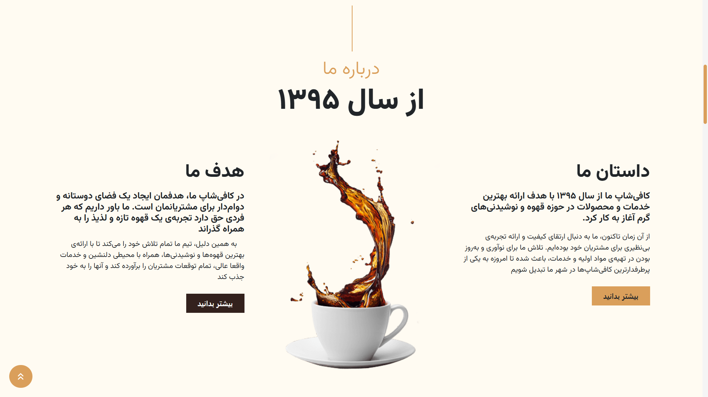
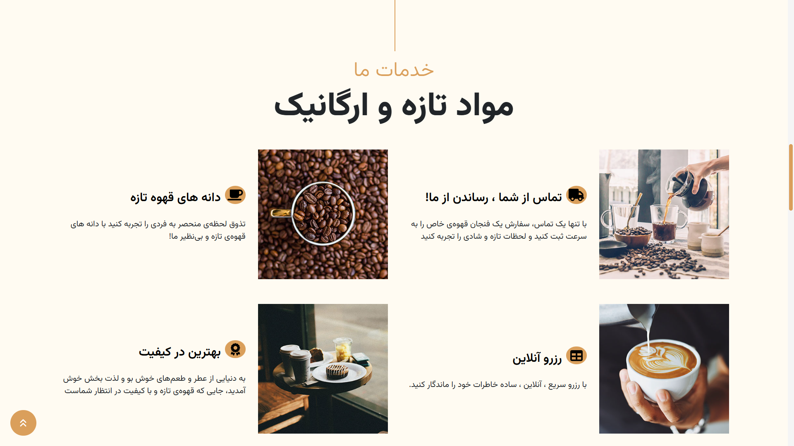

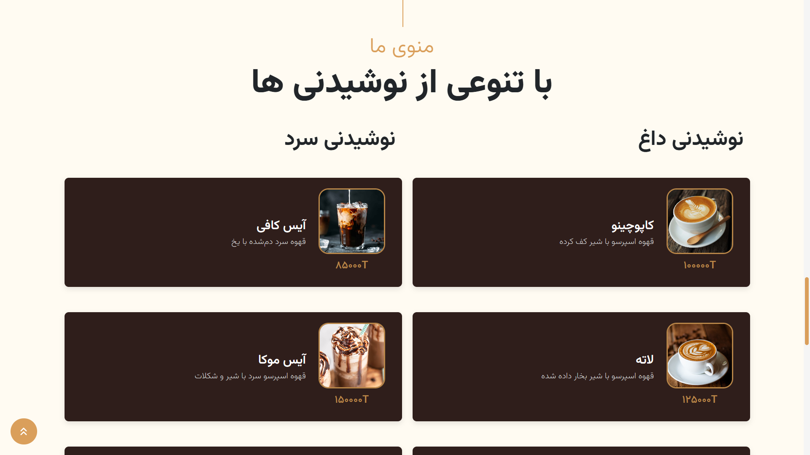
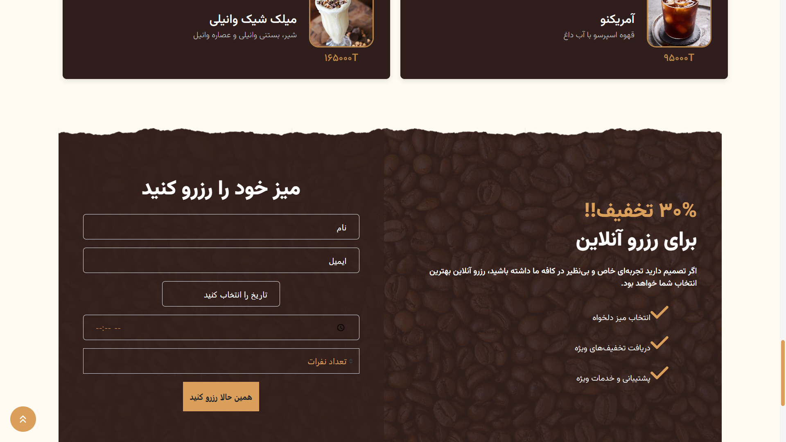
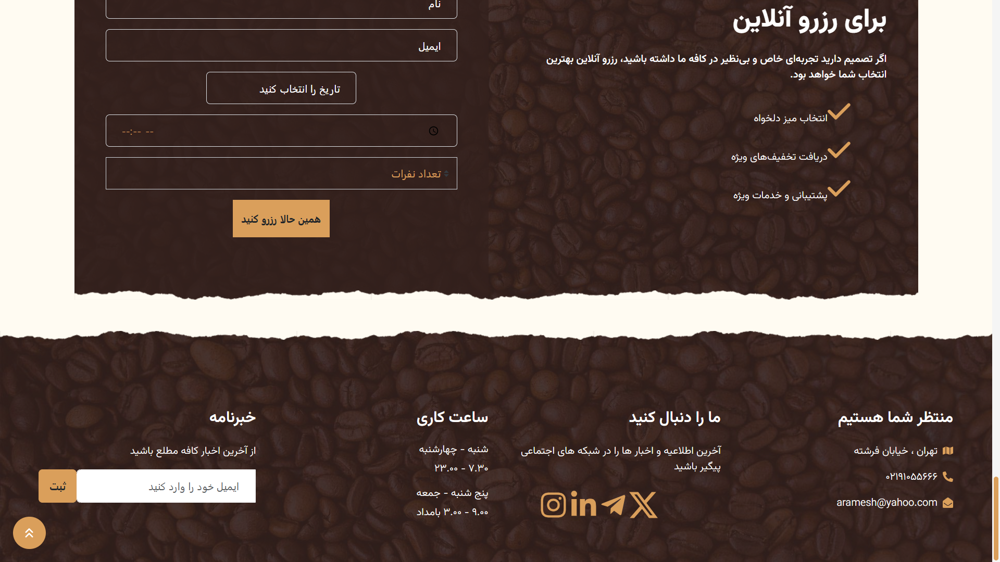

### 👤 درباره ما / About Me
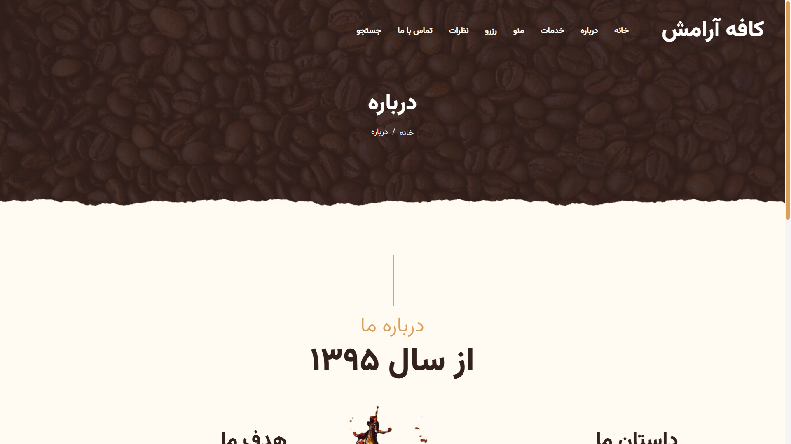

### 🍽️ سرویس‌ها / Services
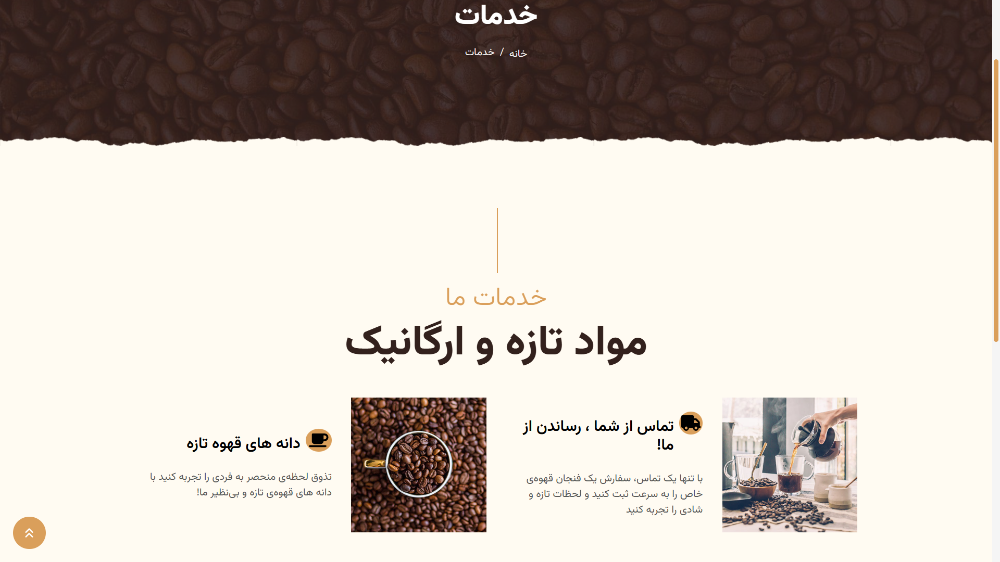

### 🛍️ محصولات / Products
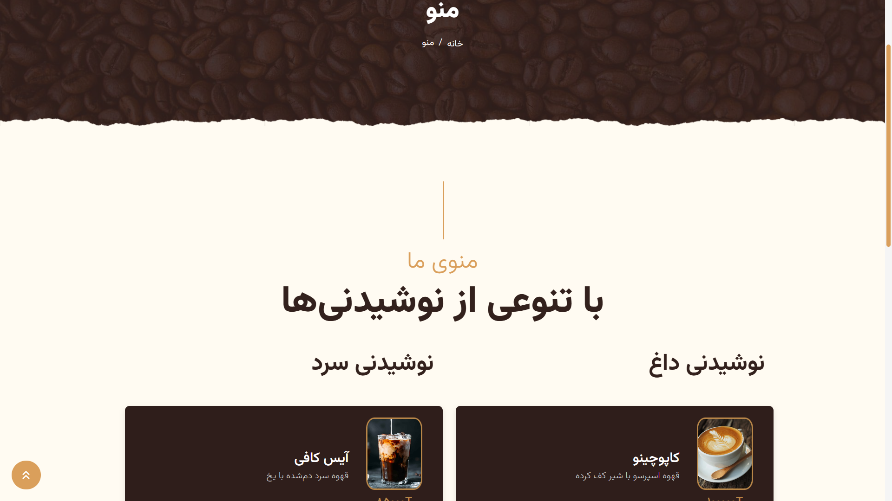

### 📅 رزرو / Reservation
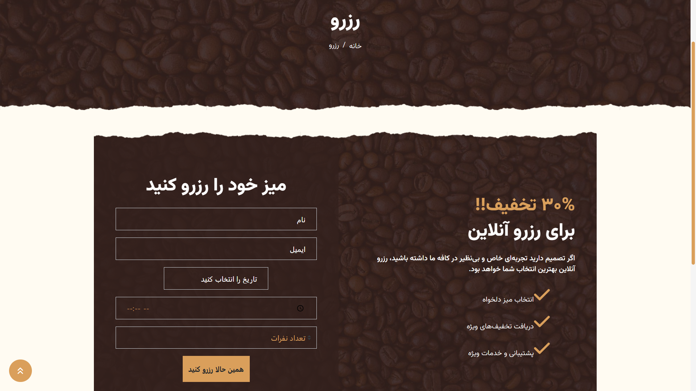

### 🚫 صفحه 404 / Not Found
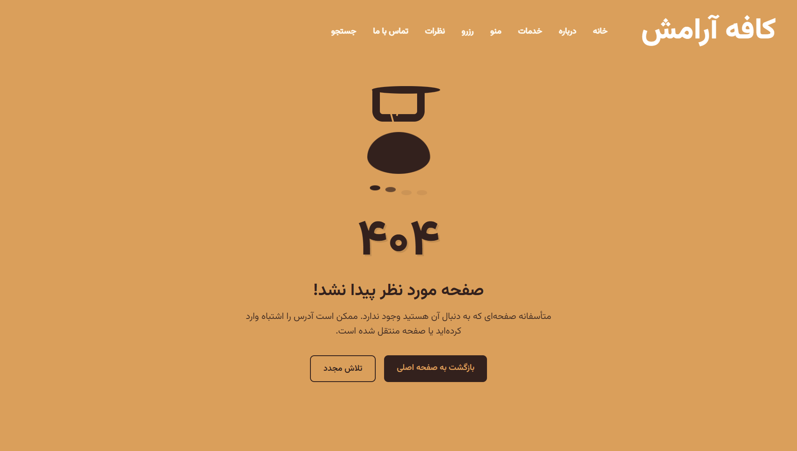

### ⏳ لودینگ / Loading
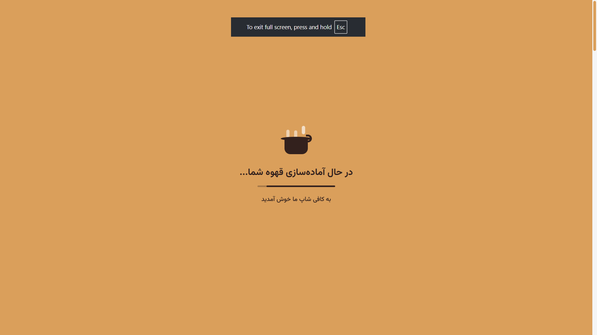

---

## 🚀 اجرا | Run Locally

```bash
# کلون کردن مخزن / Clone the project
git clone https://github.com/erfanHP390/website-coffee-shop.git
cd website-coffee-shop

# نصب وابستگی‌ها / Install dependencies
npm install

# ساخت فایل محیطی / Setup environment variables
# ایجاد فایل .env.local در ریشه پروژه و اضافه کردن مقادیر زیر
MONGODB_URI=your_mongodb_connection_string
NEXT_PUBLIC_SITE_URL=http://localhost:3000

# اجرای سرور توسعه / Run development server
npm run dev
